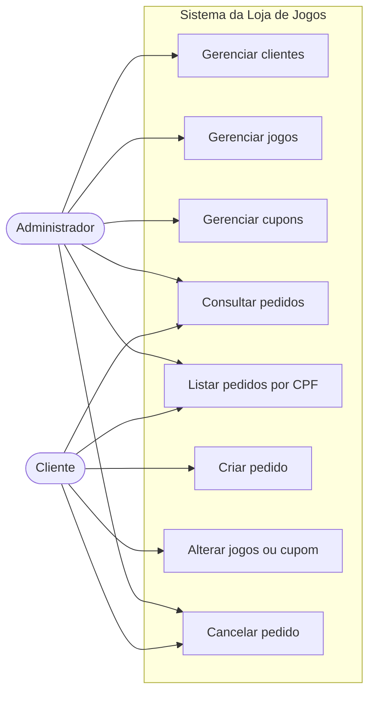
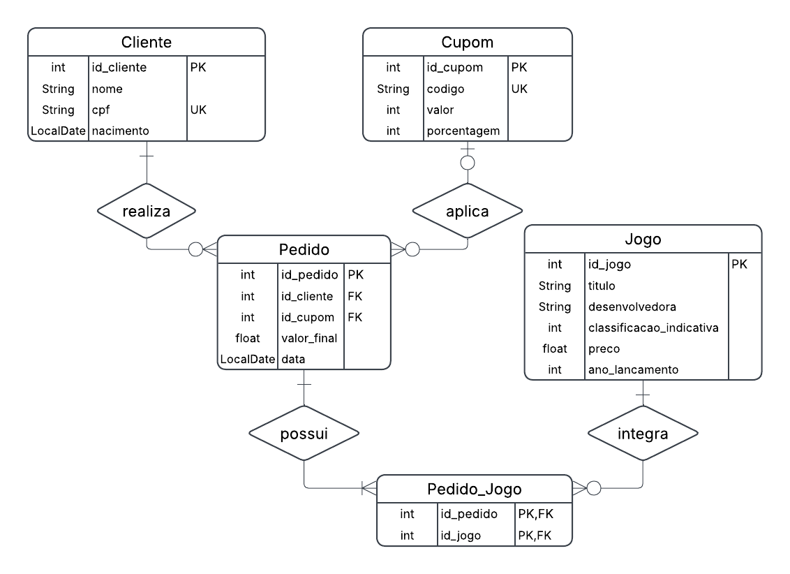
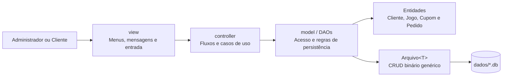

# Loja de Jogos: Trabalho Prático de AED III

> Sistema acadêmico de gerenciamento de clientes, jogos, cupons e pedidos, desenvolvido em Java com persistência própria em arquivos binários.

**Instituição:** Pontifícia Universidade Católica de Minas Gerais  
**Unidade:** Instituto de Ciências Exatas e Informática  
**Disciplina:** Algoritmos e Estruturas de Dados III  
**Integrantes:** Augusto, Ramses e Ravi

## 1. Descrição do problema

O projeto implementa uma loja de jogos executada por menus no terminal. O sistema mantém cadastros de clientes, jogos e cupons e permite criar pedidos com vários jogos, aplicar descontos e preservar os dados entre diferentes execuções.

Em vez de utilizar um banco de dados ou uma biblioteca pronta de persistência, os registros são serializados em arquivos binários. Cada arquivo possui cabeçalho, identificadores sequenciais, exclusão lógica por lápide e uma lista encadeada de espaços excluídos que podem ser reutilizados.

## 2. Objetivo do trabalho

O objetivo é aplicar conceitos de organização de arquivos e estruturas de dados por meio de um sistema capaz de:

- realizar operações de criação, consulta, atualização e exclusão de registros;
- representar relacionamentos entre clientes, pedidos, jogos e cupons;
- armazenar objetos em arquivos binários;
- controlar registros ativos e excluídos logicamente;
- reutilizar espaços liberados por exclusões;
- separar interface, controle, entidades e acesso aos dados.

## 3. Requisitos funcionais

- **RF01 — Gerenciar clientes:** incluir, buscar por ID ou CPF, alterar o nome, excluir e listar clientes ativos.
- **RF02 — Gerenciar jogos:** incluir, buscar por ID, alterar, excluir e listar jogos ativos.
- **RF03 — Gerenciar cupons:** incluir, buscar, alterar, excluir e listar cupons ativos; localizar um cupom pelo código ao montar um pedido.
- **RF04 — Criar pedidos:** associar um cliente a um ou mais jogos.
- **RF05 — Aplicar cupons:** vincular opcionalmente um cupom ao pedido e aplicar desconto percentual e/ou valor fixo.
- **RF06 — Calcular o total:** somar os preços dos jogos, aplicar os descontos e impedir que o resultado fique negativo.
- **RF07 — Alterar pedidos:** adicionar ou remover jogos, trocar ou retirar o cupom e recalcular o valor final.
- **RF08 — Consultar pedidos:** buscar por ID, listar todos ou filtrar os pedidos pelo CPF do cliente.
- **RF09 — Cancelar pedidos:** excluir logicamente um pedido.
- **RF10 — Oferecer perfis de navegação:** disponibilizar menus distintos para administrador e cliente.

## 4. Requisitos não funcionais e características técnicas

- Aplicação escrita em **Java**, sem dependências externas.
- Interface textual baseada em menus e entrada pelo console.
- Persistência obrigatória em arquivos binários locais.
- Cabeçalho de 12 bytes em cada arquivo: último ID utilizado e início da lista de espaços excluídos.
- Exclusão lógica por lápide, sem remoção física imediata do registro.
- Reutilização de espaços disponíveis quando um bloco excluído comporta um novo registro.
- Organização do código em camadas por meio dos pacotes `view`, `controller` e `model`.
- Criação automática do diretório `dados/` durante o uso do sistema.

## 5. Atores

### Administrador

Gerencia clientes, jogos e cupons. Também pode buscar pedidos, listar todos os pedidos, consultar pedidos por CPF e cancelá-los.

### Cliente

Acessa as operações de pedidos para consultar, listar por CPF, criar, alterar ou cancelar um pedido. O perfil representa um fluxo de navegação; a versão atual não implementa autenticação.

## 6. Diagrama de caso de uso



## 7. Diagrama entidade-relacionamento



O modelo contém quatro entidades principais:

- **Cliente:** `id_cliente`, `nome`, `cpf` e `nascimento`;
- **Jogo:** `id_jogo`, `titulo`, `desenvolvedora`, `classificacao_indicativa`, `preco` e `ano_lancamento`;
- **Cupom:** `id_cupom`, `codigo`, `valor` e `porcentagem`;
- **Pedido:** `id_pedido`, `id_cliente`, `id_cupom`, `valor_final` e `data`.

O relacionamento entre pedidos e jogos é muitos-para-muitos. No DER, ele é representado pela entidade associativa `Pedido_Jogo`. Na implementação atual em arquivos binários, essa associação é armazenada como uma lista de IDs de jogos dentro do próprio registro de `Pedido`.

## 8. Modelo de persistência

Cada entidade utiliza uma instância da classe genérica `Arquivo<T>`, responsável pelas operações básicas de persistência. Os dados ficam organizados da seguinte forma:

```text
dados/
├── clientes/clientes.db
├── cupons/cupons.db
├── jogos/jogos.db
└── pedidos/pedidos.db
```

### Cabeçalho do arquivo

| Campo | Tamanho | Finalidade |
| --- | ---: | --- |
| Último ID utilizado | 4 bytes (`int`) | Gera IDs sequenciais para novos registros |
| Início da lista de excluídos | 8 bytes (`long`) | Guarda o endereço do primeiro espaço disponível ou `-1` |

### Organização de cada registro

| Campo | Tamanho | Finalidade |
| --- | ---: | --- |
| Lápide | 1 byte | Espaço indica registro ativo; `*` indica registro excluído |
| Tamanho do registro | 2 bytes (`short`) | Informa quantos bytes devem ser lidos |
| Dados serializados | variável | Conteúdo produzido pelo método `toByteArray()` da entidade |

As entidades implementam a interface `Registro`, que define acesso ao ID e os métodos de serialização e desserialização. Strings, números e datas são gravados com `DataOutputStream`; a leitura utiliza `DataInputStream`. Datas são armazenadas como quantidade de dias desde a época Unix (`LocalDate.toEpochDay()`).

Quando um registro é excluído, sua lápide é alterada e o espaço entra em uma lista encadeada de blocos disponíveis. Em uma atualização, o registro é sobrescrito no mesmo local quando o novo conteúdo cabe no espaço original; caso contrário, o bloco antigo é marcado como excluído e o conteúdo é realocado.

## 9. Arquitetura proposta



### Responsabilidades das camadas

- **`view`:** apresenta menus, coleta dados e exibe mensagens no console.
- **`controller`:** coordena as opções de administrador e cliente e chama os DAOs necessários.
- **`model`:** contém as entidades, suas regras de serialização, os DAOs e a classe genérica de arquivo.
- **`dados`:** armazena os arquivos binários gerados durante a execução.

## 10. Validação de escopo

| Item | Atendido | Evidência |
| --- | :---: | --- |
| Possui pelo menos três entidades? | Sim | Cliente, Jogo, Cupom e Pedido |
| Possui relacionamento 1:N? | Sim | Um cliente pode realizar vários pedidos; um cupom pode ser usado em vários pedidos |
| Possui relacionamento N:N? | Sim | Um pedido contém vários jogos e um jogo pode integrar vários pedidos |
| Possui atributo multivalorado? | Sim | `Pedido.idJogos` armazena vários IDs |
| Possui campo de data? | Sim | `Cliente.nascimento` e `Pedido.data` |
| Possui campo real? | Sim | `Jogo.preco` e `Pedido.valorFinal` |

## Tecnologias utilizadas

- Java 8 ou superior
- API de arquivos `RandomAccessFile`
- Serialização manual com `DataInputStream` e `DataOutputStream`
- `LocalDate` para datas
- Mermaid para os diagramas renderizados pelo GitHub

## Estrutura do projeto

```text
Aeds3-/
├── controller/
│   ├── Principal.java
│   ├── MenuAdmin.java
│   ├── MenuClientes.java
│   ├── MenuJogos.java
│   ├── MenuCupons.java
│   └── MenuPedidos.java
├── model/
│   ├── Arquivo.java
│   ├── Registro.java
│   ├── Cliente.java e ClienteDAO.java
│   ├── Jogo.java e JogoDAO.java
│   ├── Cupom.java e CupomDAO.java
│   └── Pedido.java e PedidoDAO.java
├── view/
│   ├── ConsoleView.java
│   ├── PrincipalView.java
│   ├── AdminView.java
│   ├── ClienteView.java
│   ├── JogoView.java
│   ├── CupomView.java
│   └── PedidoView.java
└── dados/                         # criado automaticamente durante a execução
```

## Como executar

### Pré-requisito

Tenha um JDK instalado e confirme a disponibilidade dos comandos `javac` e `java`.

### Compilação

Na raiz do projeto, execute:

```bash
javac -encoding UTF-8 -d out controller/*.java model/*.java view/*.java
```

### Execução

```bash
java -cp out controller.Principal
```

Os arquivos binários serão criados em `dados/`, relativamente ao diretório em que o programa for iniciado. Para preservar a base entre execuções, execute sempre a aplicação a partir da raiz do projeto.

## Observações da implementação atual

- As consultas por CPF e código de cupom percorrem sequencialmente os registros ativos.
- O DER identifica `cpf` e `codigo` como campos únicos, mas a versão atual ainda não impede duplicidades no momento do cadastro.
- A integridade entre arquivos é controlada pela lógica da aplicação, sem chaves estrangeiras físicas.
- O projeto ainda não inclui testes automatizados nem uma ferramenta de build como Maven ou Gradle.

## Autores

- Augusto
- Ramses
- Ravi
